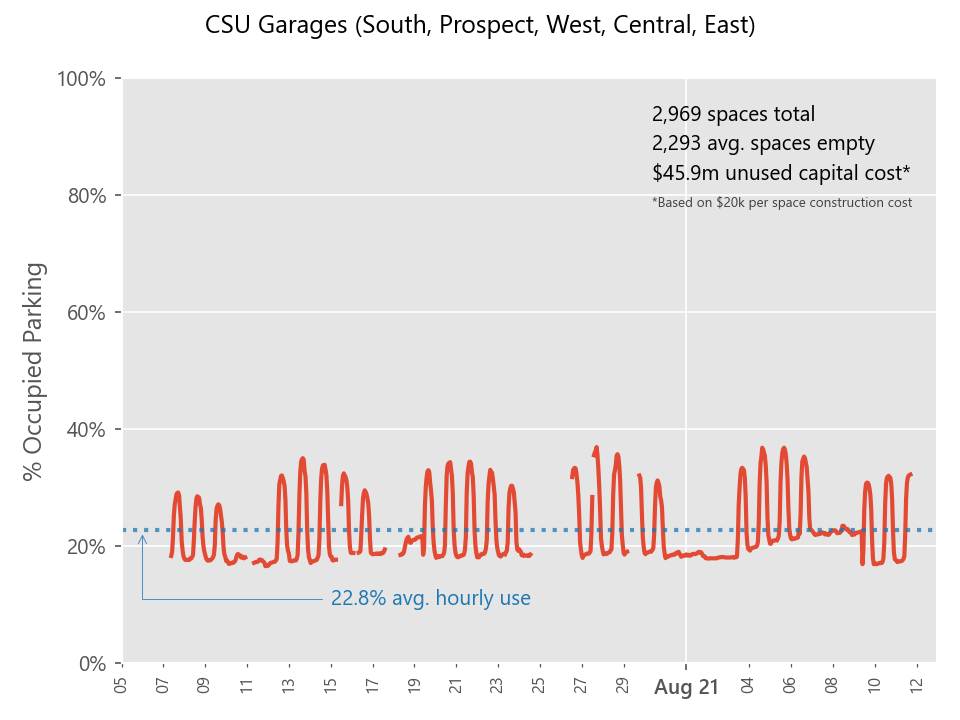

# csu-parking-scraper
## Purpose

To quantify how overbuilt the campus' parking facilities are. Structured garages cost millions in capital
funds that can go to more active uses for students and the built environment of the campus;
it subsidizes and encourages unsustainable transportation patterns, and after all this, it sits empty most of the time.

At about $20,000 per space for construction cost, the five garages that are scraped here probably cost
somewhere around **$60 million** dollars to build; they also have debt to be paid and millions in operating costs.

[Why America Has So Many Empty Parking Spaces](https://www.mentalfloss.com/article/503014/why-america-has-so-many-empty-parking-spaces)

[The High Cost of Free Parking](https://www.youtube.com/watch?v=Akm7ik-H_7U&feature=emb_title)

## Summary 
* A simple scraper script that obtains parking availability numbers from 
[Cleveland State University's live parking portal](http://parkingspaces.csuohio.edu/).

* Intended to be left running in background (coded for 15 minute intervals but can remove infinite loop and run on Task Scheduler or similar)

* Still testing accuracy, consistency and usefulness of source.
    
* The main issue on this data source is whether capacity is dictated by an arbitrary number of managed spaces or if it refl
  ects actual physical capacity.  
  According to the [CSU sites for each garage](https://www.csuohio.edu/parking/west-garage) there is the following
  amount of parking capacity:
  * 611 spaces in South Garage
  * 291 spaces in Prospect Garage
  * 600 spaces in West Garage
  * 867 spaces in Central Garage
  * 600 spaces in East Garage

* Will be posting my scraped data here semi-regularly

*Example*
