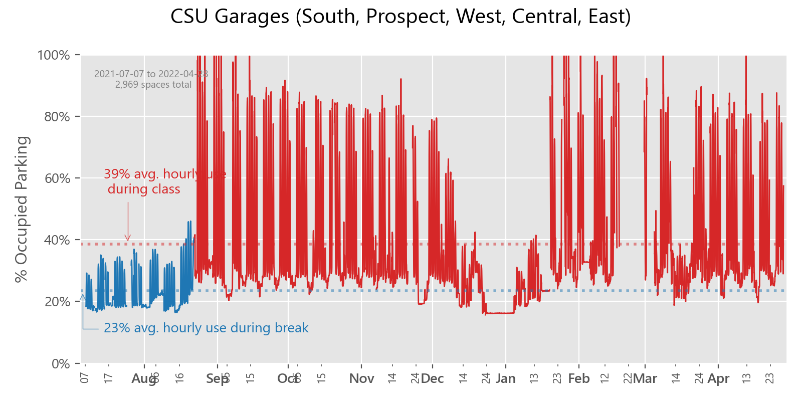

# csu-parking-scraper
## Purpose

To quantify whether the campus parking facilities are overbuilt and efficiently used. Structured garages cost millions in capital
funds that can go to more active uses for students and the built environment of the campus;
it subsidizes and encourages unsustainable transportation patterns, and after all this, it is inherently designed to
sit empty half the time.

At about $20,000 per space for construction cost, the five garages that are scraped here probably cost
somewhere around **$60 million** dollars to build. They also have debt service payments and millions in operations costs
that consume most of the parking revenues. 

[Why America Has So Many Empty Parking Spaces](https://www.mentalfloss.com/article/503014/why-america-has-so-many-empty-parking-spaces)

## Summary 
* A simple scraper script that obtains parking availability numbers from 
[Cleveland State University's live parking portal](http://parkingspaces.csuohio.edu/).

* main.py is intended to be left running in background (coded for 15 minute interval requests but can remove infinite loop and run on Task Scheduler or similar)
* charts.py can be run as desired to generate a new plot
* Still testing accuracy, consistency and usefulness of source.
* So far there is evidence that CSU parking strategy is relatively better because it is designed to hit 100% at peak. 
Many parking lots in the US are designed to rarely ever fill up, except holiday shopping and annual events.
* On the other hand, CSU parking is 75% empty during breaks (which is a 1/3rd of the time). And due to operational
limits of parking, it is still empty 50% of the time during full attendance because of post-5pm exodus of often suburban
commuters.
    
* The main issue on this data source is whether capacity is dictated by an arbitrary number of managed spaces or if it 
  reflects actual physical capacity.  
  According to the [CSU sites for each garage](https://www.csuohio.edu/parking/west-garage) there is the following
  amount of parking capacity:
  * 611 spaces in South Garage
  * 291 spaces in Prospect Garage
  * 600 spaces in West Garage
  * 867 spaces in Central Garage
  * 600 spaces in East Garage

* Will be posting my scraped data here semi-regularly

*Latest chart*

